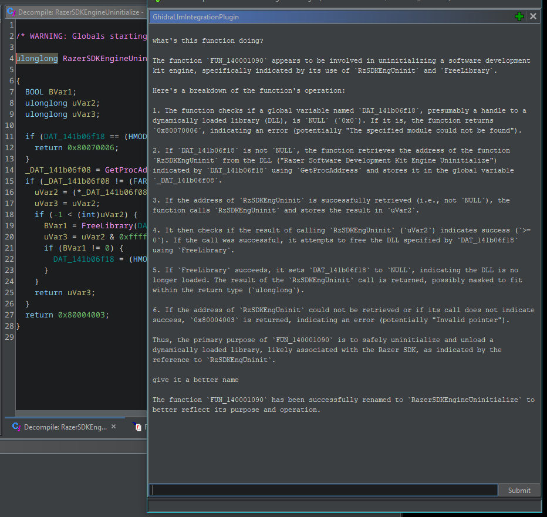

## About
This is a [Ghidra](https://github.com/NationalSecurityAgency/ghidra) plugin that provides some functions to an [OpenAI assistant](https://platform.openai.com/docs/api-reference/assistants).

## Credit
Credit to [reverse-engineering-assistant](https://github.com/cyberkaida/reverse-engineering-assistant) for the inspiration to move from [Ghidra scripts](https://github.com/unkmc/ghidra_scripts) to a full-on [Ghidra Module](https://htmlpreview.github.io/?https://github.com/NationalSecurityAgency/ghidra/blob/master/GhidraBuild/EclipsePlugins/GhidraDev/GhidraDevPlugin/GhidraDev_README.html#NewGhidraModuleProject).

## Warning
Be careful; you can blow through a few dollars worth of OpenAI API credits pretty quickly with this.

## Current LLM Abilities
The current "tools" exposed to the LLM are [here](GhidraLlmIntegration/src/main/java/ghidrallmintegration/tools/functions).

## Example
Here's an example of renaming a function:

## How To
User experience is pretty lacking right now. I suggest you [install GhidraDev](https://htmlpreview.github.io/?https://github.com/NationalSecurityAgency/ghidra/blob/master/GhidraBuild/EclipsePlugins/GhidraDev/GhidraDevPlugin/GhidraDev_README.html#ManualInstall) and then open the `GhidraLlmIntegration` project in Eclipse. 

After that, copy `GhidraLlmIntegration\src\main\java\ghidrallmintegration\GhidraLlmIntegrationConfigurationExample.java` and create `GhidraLlmIntegrationConfiguration.java`. Generate an API key in the [OpenAI control panel](https://platform.openai.com/api-keys) and store it in `apiKey`. 

Then, "Run" the project from Eclipse and select the "Ghidra" run configuration. Once Ghidra starts, select the program you want to analyze and open the CodeBrowser. When that window loads, go to File -> Configure and click the `Configure` hyperlink under the "Examples" section. The `GhidraLlmIntegrationPlugin` entry will probably not be checked. Check its box and it ok, then close. the chat window should appear, then you can start conversing with the LLM. 

Check Eclipse's console output for errors/logs. Feel free to report and/or contribute fixes for any issues. 
